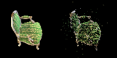
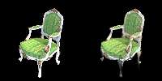

# ASSIGNMENT-4

## 1. 3D Gaussian Splatting

3D Gaussian splatting represents 3D scenes using smooth Gaussian functions instead of discrete points or meshes. Each Gaussian splat acts as a soft, volumetric point, creating continuous, noise-free surfaces. This technique is memory-efficient, handles large datasets like point clouds, and delivers high-quality, real-time rendering. It excels in applications requiring smooth geometry, such as interactive 3D visualization or volumetric rendering, and reduces artifacts common in traditional methods. The repository provides tools for efficient scene representation and real-time updates, making it ideal for large-scale 3D environments, scientific visualization, and AR/VR applications.

This is a simplified version of 3DGS (see the original project: [https://github.com/graphdeco-inria/gaussian-splatting](https://github.com/graphdeco-inria/gaussian-splatting)).

## 2. COLAP

Below is a point cloud projection of a chair by COLAP:



As we can see, the set of points is sparse, which is far from satisfactory.

Based on the COLAP point cloud, we achieve a simplified version of 3DGS.

## 3. SIMPLIFIED 3DGS

### 3.1 RUNNING

To get a 3DGS output of the chair, simply run:

```bash
python train.py --colmap_dir data/chair --checkpoint_dir data/chair/checkpoints
```

### 3.2 OUTPUT



[Output Demo GIF](output_demo.gif)

## 4. ORIGINAL 3DGS

We implemented the original 3DGS as a comparison. The visualization of the `.ply` output is based on [see reference](https://github.com/antimatter15/splat).

### 4.1 RESULT

[Original 3DGS Result GIF](origin_3dGS.gif)
